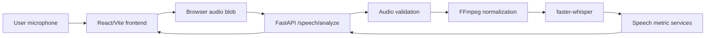

# Speech Analyzer

Speech Analyzer is a full-stack web application that records speech directly in the browser and analyzes the recording for transcription, timing, speaking pace, pauses, filler words, speech/silence distribution, and a derived fluency score.

## Overview

The application is designed for speakers, students, presenters, and developers who want a practical way to inspect speech delivery from a short recording.

A user records speech in the frontend. The browser sends the recording to the FastAPI backend, where the audio is validated, normalized with FFmpeg, transcribed using `faster-whisper`, and analyzed using word-level timestamps.

### Main Workflow

1. The user grants microphone access and records speech in the React frontend.
2. The frontend stores the recording as a WebM or Ogg audio blob.
3. The frontend uploads the recording to the FastAPI backend.
4. The backend validates the uploaded file.
5. FFmpeg converts the audio to mono 16 kHz WAV.
6. `faster-whisper` transcribes the normalized audio with word timestamps.
7. Speech-analysis services calculate pace, pauses, filler words, speech/silence percentages, and fluency.
8. The frontend displays the transcript, metrics, word timeline, and pause timeline.

## Key Features

* Browser-based microphone recording using the `MediaRecorder` API.
* Automatic analysis after recording stops.
* Audio playback for recorded speech.
* Multipart audio upload to the backend.
* Audio content-type validation.
* Empty-file validation.
* Upload size validation.
* Recording-duration validation.
* FFmpeg-based audio normalization.
* Mono 16 kHz WAV conversion.
* Speech transcription using `faster-whisper`.
* Word-level timestamps.
* Pause detection from gaps between recognized words.
* Overall WPM calculation.
* Speaking-only WPM calculation.
* Pace classification.
* Filler-word detection.
* Filler-phrase detection.
* Speech and silence percentages.
* Application-derived fluency score.
* Backend health-check endpoint.
* Backend unit tests.
* Docker support for frontend and backend.
* GitHub Actions workflow for backend testing/demo deployment.
* Temporary Cloudflare Tunnel support for exposing the backend during workflow execution.

## How It Works



### Browser Recording

The frontend selects the first supported recording MIME type from:

* `audio/webm;codecs=opus`
* `audio/webm`
* `audio/ogg;codecs=opus`
* `audio/ogg`

Browser support determines which format is ultimately recorded.

### Backend Processing

After receiving an audio file, the backend:

1. Saves the uploaded file temporarily.
2. Validates the content type and file size.
3. Uses FFmpeg to normalize the audio.
4. Reads the normalized WAV metadata.
5. Transcribes the normalized audio.
6. Extracts and validates word-level timestamps.
7. Calculates speech metrics.
8. Returns the analysis as JSON.
9. Removes temporary files.

## Technology Stack

### Frontend

| Technology | Version / Source | Purpose |
| --- | --- | --- |
| React | `^19.2.8` | UI rendering |
| React DOM | `^19.2.8` | Browser rendering |
| TypeScript | `~6.0.2` | Static typing |
| Vite | `^8.2.2` | Development server and production build |
| Tailwind CSS | `^4.3.3` | Styling |
| ESLint | `^10.9.0` | Linting |
| MediaRecorder API | Browser API | Microphone recording |

### Backend

| Technology | Version / Source | Purpose |
| --- | --- | --- |
| Python | `3.11` | Runtime |
| FastAPI | `0.141.1` | HTTP API |
| Uvicorn | `0.52.4` | ASGI server |
| Pydantic | `2.13.4` | Data validation and response schemas |
| python-multipart | `0.0.32` | Multipart file uploads |
| soundfile | `0.14.0` | WAV handling and test audio generation |

### AI / Machine Learning

| Technology | Version | Purpose |
| --- | --- | --- |
| faster-whisper | `1.2.1` | Speech transcription |
| ctranslate2 | `4.8.1` | faster-whisper inference runtime |
| onnxruntime | `1.29.0` | ML runtime dependency |
| Hugging Face Hub | `1.29.0` | Model retrieval and caching |

### Whisper Configuration

The application initializes `WhisperModel` with:

* Model size: `small`
* Device: `cpu`
* Compute type: `int8`
* Language: `None` for automatic language detection
* Beam size: `1`
* Word timestamps: enabled
* VAD filter: enabled

## APIs

### Backend

The local backend runs on:

```text
http://127.0.0.1:8000
```

### Browser APIs

Microphone access uses:

```text
navigator.mediaDevices.getUserMedia
```

## Deployment / Infrastructure

The project includes:

* `backend/Dockerfile` for containerizing the FastAPI backend.
* `frontend/Dockerfile` for building and serving the Vite frontend.
* Nginx for serving the production frontend container.
* GitHub Actions for automated backend build/test/demo workflow.
* Cloudflare Tunnel for temporarily exposing the backend during the GitHub Actions workflow.

The Cloudflare Tunnel workflow is intended for **temporary testing/demo purposes** and is **not a permanent backend hosting solution**.

## Project Structure

```text
.
|-- .github/
|   `-- workflows/
|       `-- speech-backend.yml
|
|-- backend/
|   |-- app/
|   |   |-- api/
|   |   |   `-- routes/
|   |   |       `-- speech.py
|   |   |-- schemas/
|   |   |   `-- speech.py
|   |   |-- services/
|   |   |   |-- audio_normalization.py
|   |   |   |-- audio_validation.py
|   |   |   |-- pause_analysis.py
|   |   |   |-- speech_analysis.py
|   |   |   |-- speech_metrics.py
|   |   |   `-- transcription.py
|   |   `-- main.py
|   |
|   |-- tests/
|   |-- Dockerfile
|   `-- requirements.txt
|
|-- frontend/
|   |-- public/
|   |-- src/
|   |   |-- api/
|   |   |   `-- speech.ts
|   |   |-- App.tsx
|   |   |-- App.css
|   |   |-- index.css
|   |   `-- main.tsx
|   |-- Dockerfile
|   |-- package.json
|   |-- package-lock.json
|   `-- vite.config.ts
|
`-- README.md
```

### Important Files

| Path | Purpose |
| --- | --- |
| `frontend/src/App.tsx` | Main recording UI and results workspace |
| `frontend/src/api/speech.ts` | Frontend API client |
| `backend/app/main.py` | FastAPI application setup, CORS, and health endpoint |
| `backend/app/api/routes/speech.py` | `/speech/analyze` API route |
| `backend/app/services/transcription.py` | Whisper model initialization and word extraction |
| `backend/app/services/audio_normalization.py` | FFmpeg audio normalization |
| `backend/app/services/audio_validation.py` | Upload validation |
| `backend/app/services/speech_analysis.py` | Speech-analysis orchestration |
| `backend/app/services/pause_analysis.py` | Pause detection |
| `backend/app/services/speech_metrics.py` | WPM, filler, pace, percentage, and fluency calculations |
| `backend/tests/` | Backend test suite |

## Prerequisites

For local development:

* Node.js and npm.
* Python 3.11.
* FFmpeg available on `PATH`.
* Internet access may be required on the first backend startup so `faster-whisper` can download the configured model if it is not already cached.

For Docker:

* Docker Desktop or Docker Engine.

The backend Docker image installs FFmpeg automatically.

The frontend Docker image uses `node:22-alpine` for building and `nginx:alpine` for serving the production application.

## Installation

Clone the repository:

```bash
git clone https://github.com/Haris-Hussain1/speech.git
cd speech
```

### Backend Setup

```bash
cd backend
python -m venv .venv
```

#### Windows PowerShell

```powershell
.\.venv\Scripts\Activate.ps1
```

#### macOS / Linux

```bash
source .venv/bin/activate
```

Install dependencies:

```bash
pip install -r requirements.txt
```

Verify FFmpeg:

```bash
ffmpeg -version
```

### Frontend Setup

```bash
cd frontend
npm install
```

Because the repository contains `package-lock.json`, clean/CI installations can use:

```bash
npm ci
```

## Environment Variables

### Backend

| Variable | Required | Purpose |
| --- | --- | --- |
| `ALLOWED_ORIGINS` | Recommended | Comma-separated list of allowed frontend origins |
| `PORT` | Optional | Backend port; defaults to `8000` |
| `HF_HOME` | Optional | Hugging Face model cache location |

Example:

```env
ALLOWED_ORIGINS=http://localhost:5173,http://127.0.0.1:5173
```

> **Important:** The backend does not automatically load `.env` files. Environment variables must be supplied through the shell, Docker, or the deployment platform.

### Frontend

| Variable | Required | Purpose |
| --- | --- | --- |
| `VITE_API_BASE_URL` | Optional locally | Backend API base URL |

Example:

```env
VITE_API_BASE_URL=http://127.0.0.1:8000
```

If `VITE_API_BASE_URL` is not defined, the frontend defaults to:

```text
http://127.0.0.1:8000
```

For production, `VITE_API_BASE_URL` must point to the publicly accessible backend.

> **Note:** Vite environment variables are embedded into the application during the frontend build.

## Running Locally

### Start the Backend

#### Windows PowerShell

```powershell
cd backend
.\.venv\Scripts\Activate.ps1

$env:ALLOWED_ORIGINS = "http://localhost:5173,http://127.0.0.1:5173"

uvicorn app.main:app --reload --host 127.0.0.1 --port 8000
```

#### macOS / Linux

```bash
cd backend
source .venv/bin/activate

export ALLOWED_ORIGINS="http://localhost:5173,http://127.0.0.1:5173"

uvicorn app.main:app --reload --host 127.0.0.1 --port 8000
```

The backend will be available at:

```text
http://127.0.0.1:8000
```

Check the health endpoint:

```bash
curl http://127.0.0.1:8000/health
```

Expected response:

```json
{
  "status": "ok"
}
```

### Start the Frontend

Open another terminal:

```bash
cd frontend
npm run dev
```

Vite normally serves the application at:

```text
http://localhost:5173
```

## API Documentation

### `GET /health`

Returns the backend health status.

Response:

```json
{
  "status": "ok"
}
```

### `POST /speech/analyze`

Analyzes an uploaded audio recording.

| Field | Value |
| --- | --- |
| Method | `POST` |
| Route | `/speech/analyze` |
| Content Type | `multipart/form-data` |
| Required Form Field | `file` |
| Authentication | None |

### Supported Audio Content Types

* `audio/webm`
* `audio/ogg`
* `audio/wav`
* `audio/wave`
* `audio/x-wav`
* `audio/mpeg`
* `audio/mp4`
* `audio/x-m4a`

### Limits

* Maximum uploaded file size: `50 MB`
* Maximum normalized recording duration: `30 minutes`

Example request:

```bash
curl -X POST http://127.0.0.1:8000/speech/analyze \
  -F "file=@speech-recording.webm;type=audio/webm"
```

### Example Response

```json
{
  "transcript": "hello world",
  "recording_duration": 1.0,
  "speaking_duration": 0.7,
  "pause_duration": 0.3,
  "total_words": 2,
  "words_per_minute": 171.428571,
  "average_word_duration": 0.35,
  "words": [
    {
      "text": "hello",
      "start": 0.1,
      "end": 0.4,
      "duration": 0.3
    },
    {
      "text": "world",
      "start": 0.5,
      "end": 0.9,
      "duration": 0.4
    }
  ],
  "overall_words_per_minute": 120.0,
  "speaking_words_per_minute": 171.428571,
  "pause_count": 0,
  "average_pause_duration": 0.0,
  "longest_pause_duration": 0.0,
  "silence_percentage": 30.0,
  "speech_percentage": 70.0,
  "filler_word_count": 0,
  "filler_word_rate": 0.0,
  "pace": "Fast",
  "fluency_score": 92.8571428,
  "pauses": []
}
```

### Response Headers

The API may return:

| Header | Purpose |
| --- | --- |
| `X-Speech-Timing` | Timing diagnostics for upload processing, validation, FFmpeg normalization, transcription, metric calculation, WAV metadata, segment count, and word count |

### Error Responses

| Status | Example Detail | Cause |
| --- | --- | --- |
| `400` | `Audio content type is missing.` | Upload did not include a content type |
| `400` | `The uploaded audio file is empty.` | Empty upload |
| `400` | `Unsupported audio format: text/plain` | Unsupported content type |
| `400` | `The audio file is too large. Maximum size is 50 MB.` | File exceeds size limit |
| `400` | `The recording is too long. Maximum duration is 30 minutes.` | Recording exceeds duration limit |
| `422` | `FFmpeg could not normalize the audio.` | FFmpeg could not decode or convert the audio |
| `422` | `FFmpeg is not installed or is not available on PATH.` | FFmpeg is unavailable |
| `500` | `Unable to analyze the audio recording.` | Unexpected processing/transcription failure |

## Frontend / Backend Configuration

The frontend determines the backend URL in:

```text
frontend/src/api/speech.ts
```

The configuration follows:

```ts
const API_BASE_URL =
  import.meta.env.VITE_API_BASE_URL || "http://127.0.0.1:8000";
```

### Local Development

```text
Frontend:
http://localhost:5173

Backend:
http://127.0.0.1:8000
```

Backend CORS should include:

```text
http://localhost:5173
http://127.0.0.1:5173
```

### Production

The frontend must be built with:

```text
VITE_API_BASE_URL=<public-backend-url>
```

The backend must include the deployed frontend origin in:

```text
ALLOWED_ORIGINS
```

## Deployment

### Frontend Docker Image

Build the frontend:

```bash
cd frontend

docker build \
  --build-arg VITE_API_BASE_URL=https://your-backend.example.com \
  -t speech-frontend .
```

Run it:

```bash
docker run --rm -p 8080:80 speech-frontend
```

The Docker build:

1. Uses `node:22-alpine`.
2. Installs dependencies using `npm ci`.
3. Builds the Vite application.
4. Copies the generated `dist` directory into Nginx.
5. Serves the application on port `80`.

### Netlify

The frontend is a Vite application located inside the `frontend` directory.

If deploying the frontend to Netlify, use:

| Setting | Value |
| --- | --- |
| Base directory | `frontend` |
| Build command | `npm run build` |
| Publish directory | `dist` |
| Environment variable | `VITE_API_BASE_URL=<public-backend-url>` |

No `netlify.toml` is currently required for this configuration.

The backend must separately allow the Netlify frontend origin through `ALLOWED_ORIGINS`.

### Backend Docker Image

Build:

```bash
cd backend

docker build -t speech-backend .
```

Run:

```bash
docker run --rm -p 8000:8000 \
  -e ALLOWED_ORIGINS="http://localhost:5173,http://127.0.0.1:5173" \
  speech-backend
```

The backend image:

1. Uses `python:3.11-slim`.
2. Installs FFmpeg.
3. Installs Python dependencies.
4. Exposes port `8000`.
5. Runs Uvicorn on `0.0.0.0`.

The container command uses:

```text
uvicorn app.main:app --host 0.0.0.0 --port ${PORT:-8000}
```

## GitHub Actions and Cloudflare Tunnel

The repository contains:

```text
.github/workflows/speech-backend.yml
```

The workflow is manually triggered and is intended for backend testing/demo exposure.

The workflow:

1. Builds the backend Docker image.
2. Starts the backend container.
3. Configures the backend CORS allowlist.
4. Waits for the `/health` endpoint.
5. Installs `cloudflared`.
6. Starts a temporary Cloudflare Tunnel.
7. Exposes the backend through a generated `trycloudflare.com` URL.
8. Keeps the workflow running while the temporary tunnel is active.

### Important

This is a **temporary testing/demo deployment mechanism**.

It is **not a permanent production backend deployment**.

The generated Cloudflare Tunnel URL can change between workflow runs. If the frontend is configured to use the tunnel URL, `VITE_API_BASE_URL` must be updated accordingly and the frontend must be rebuilt.

## CORS

CORS is configured in:

```text
backend/app/main.py
```

using FastAPI's `CORSMiddleware`.

The allowed origins are loaded from:

```text
ALLOWED_ORIGINS
```

The current middleware configuration includes:

| Setting | Value |
| --- | --- |
| `allow_origins` | Parsed from `ALLOWED_ORIGINS` |
| `allow_credentials` | `False` |
| `allow_methods` | `["*"]` |
| `allow_headers` | `["*"]` |

For local Vite development:

```text
ALLOWED_ORIGINS=http://localhost:5173,http://127.0.0.1:5173
```

## AI / Speech Analysis

The speech transcription pipeline uses `faster-whisper`.

The implementation is located in:

```text
backend/app/services/transcription.py
```

### Transcription Configuration

* Model: `small`
* Device: `cpu`
* Compute type: `int8`
* Word timestamps: enabled
* VAD filter: enabled
* Beam size: `1`
* Language: automatic
* Initial prompt: general English context including Pakistani names and locations

### Audio Normalization

FFmpeg converts uploaded audio using:

```text
-vn
-ac 1
-ar 16000
-c:a pcm_s16le
```

This produces:

* Mono audio
* 16 kHz sample rate
* PCM signed 16-bit WAV output

### Word Processing

After transcription:

* Words without valid timestamps are discarded.
* Empty word text is discarded.
* Invalid timing values are discarded.
* Word timestamps are clamped to the recording duration.
* Words are sorted by timestamp.

## Speech Metrics

The application calculates several speech metrics.

### Recording Duration

The duration of the normalized WAV file.

### Speaking Duration

The union of recognized word time ranges, preventing overlapping word timestamps from being double-counted.

### Pause Duration

The portion of the recording that is not covered by recognized speaking intervals.

### Words Per Minute

Two WPM values are calculated:

* `overall_words_per_minute` - total words divided by the full recording duration.
* `speaking_words_per_minute` - total words divided by detected speaking duration.

`words_per_minute` is retained as a legacy alias for speaking WPM.

### Pause Detection

A pause is counted when the gap between consecutive recognized words is at least:

```text
0.25 seconds
```

The API provides:

* Pause count
* Average pause duration
* Longest pause duration
* Pause timeline

### Pace Classification

Speaking pace is classified as:

* `Slow`
* `Moderate`
* `Fast`
* `Very fast`

The classification is based on speaking WPM.

### Filler Words

Currently implemented filler words include:

* `um`
* `uh`
* `erm`
* `hmm`
* `like`
* `basically`
* `actually`
* `literally`

Implemented filler phrase:

* `you know`

### Fluency Score

The fluency score is an application-derived metric based on:

* Speaking pace
* Pause behavior
* Average pause duration
* Filler-word rate

> **Important:** The fluency score is a software-generated speech metric. It is not a medical, psychological, or definitive language assessment.

## Error Handling

### Frontend

The frontend handles:

* Microphone permission errors.
* Unsupported microphone/recording errors.
* Browser recording errors.
* Empty recordings.
* Backend error responses.
* Analysis/loading state.

### Backend

The backend handles:

* Invalid uploads with `400` responses.
* Audio normalization failures with `422` responses.
* Unexpected processing failures with `500` responses.
* Temporary-file cleanup using `finally`.

## Security

Implemented protections include:

* Configurable CORS allowlist.
* Credentials disabled in CORS.
* Maximum upload size of `50 MB`.
* Maximum recording duration of `30 minutes`.
* Explicit audio content-type allowlist.
* Temporary-file cleanup.
* `.gitignore` and `.dockerignore` rules for environment files, caches, logs, virtual environments, and generated build output.

### Current Security Limitations

The application currently does not implement:

* Authentication.
* Authorization.
* User accounts.
* Request-level rate limiting.
* Malware scanning.
* Persistent storage security controls.

CORS should not be treated as an authentication or authorization mechanism.

The temporary Cloudflare Tunnel workflow can publicly expose the backend while the workflow is running.

## Performance Considerations

The Whisper model is initialized when the transcription service is loaded.

Consequently:

* Backend startup can take longer while the model is initialized.
* The first request may be slower if model files need to be downloaded.
* The `small` model runs on CPU using `int8`.
* Longer recordings require more processing and transcription time.
* Maximum recording duration is limited to 30 minutes.
* Maximum upload size is limited to 50 MB.

Docker sets:

```text
HF_HOME=/root/.cache/huggingface
```

Unless an external volume is configured, the model cache exists inside the container filesystem.

The API's:

```text
X-Speech-Timing
```

header can be used to inspect timing information for different backend processing stages.

## Testing

Backend tests are located in:

```text
backend/tests/
```

Run the backend test suite:

```bash
cd backend
pytest
```

The backend tests cover:

* Speech analysis.
* API route behavior.
* Audio validation.
* Audio normalization.

Run frontend linting:

```bash
cd frontend
npm run lint
```

Run the frontend production build:

```bash
npm run build
```

## Development Notes

* The backend is organized into API routes, schemas, and service classes.
* No database is currently used.
* No persistent storage layer is currently implemented.
* No external job queue is currently used.
* The backend response schema is defined in `backend/app/schemas/speech.py`.
* The frontend API client is implemented in `frontend/src/api/speech.ts`.
* `VITE_API_BASE_URL` is embedded into the frontend during the Vite build.
* Browser microphone access normally requires HTTPS in deployed environments.
* `localhost` is permitted for local microphone development.

## Known Limitations

* No authentication or authorization.
* No database or persistent analysis history.
* No user account system.
* No visible file-upload interface in the frontend; analysis currently starts from browser microphone recording.
* Browser recording is limited to WebM/Ogg formats supported by `MediaRecorder`.
* The backend accepts additional audio formats when FFmpeg can decode them.
* Backend `.env` files are not automatically loaded.
* Default CORS fallback origins use port `3000`; Vite development normally requires port `5173`.
* Cloudflare Tunnel deployment is temporary.
* No root license file is currently included.

## Future Improvements

Potential future improvements include:

* Authentication and authorization.
* User accounts and saved analysis history.
* Request rate limiting.
* Upload malware scanning.
* Permanent backend deployment.
* `.env.example` files.
* Frontend automated tests.
* Direct audio-file upload support.
* Configurable Whisper model size.
* Configurable inference device and compute type.
* Configurable CPU thread count.
* Structured application logging.
* Request IDs and improved observability.
* Persistent storage for speech analysis results.

## Troubleshooting

### Frontend Cannot Reach Backend

Check that:

* The backend is running.
* `VITE_API_BASE_URL` points to the correct backend.
* The backend is accessible from the browser.
* `ALLOWED_ORIGINS` contains the frontend origin.

For local development:

```text
Frontend:
http://localhost:5173

Backend:
http://127.0.0.1:8000
```

### CORS Error

Set the backend CORS origins before starting Uvicorn.

PowerShell:

```powershell
$env:ALLOWED_ORIGINS = "http://localhost:5173,http://127.0.0.1:5173"
```

Then restart the backend.

### FFmpeg Error

If the backend reports:

```text
FFmpeg is not installed or is not available on PATH.
```

install FFmpeg and verify:

```bash
ffmpeg -version
```

The backend Docker image installs FFmpeg automatically.

### First Transcription Is Slow

The first transcription may take longer because the Whisper model may need to be downloaded and initialized.

Once loaded, keep the backend process running to avoid paying the initialization cost on every request.

### Microphone Access Fails

Check that:

* The browser supports `navigator.mediaDevices.getUserMedia`.
* The browser supports a compatible `MediaRecorder` MIME type.
* Microphone permission has been granted.
* The application is running on `localhost` or HTTPS.

## Contributing

1. Create a branch from `main`.
2. Keep changes focused and avoid unrelated refactoring.
3. Run backend tests with `pytest`.
4. Run frontend linting with `npm run lint`.
5. Run the frontend production build with `npm run build`.
6. Update documentation when changing behavior, configuration, setup, or deployment.
7. Open a pull request with a clear summary and testing information.

## License

No license has currently been specified for this repository.

## Author

**Haris Hussain**

Repository:

```text
https://github.com/Haris-Hussain1/speech
```
